#wisdom-of-crowds-simulation

### Description
This project is an exploration into the question - "Is the crowd more intelligent than the most intelligent individual in the crowd?". A randomized computer simulation 
is created to answer this question and offer us insights on the same. A blog post will soon be released with the findings of this project. 

### Blog

### Table of Contents

### Methodology 
* Build the computer simulation 
* Use the computer simulation to produce data 
* Analyze the data 
* Report the findings (visualizations)

### Modules 
* radnom 
* matplotlib
* seaborn
* sklearn
* pandas 
* numpy 
* os 

### Files 
* Computer Simulation Report (This includes the processing and analysis of the data)
* Wisdom of Crowds Development (This includes the development process of the computer simulation)
* SimulationDraft (Report with all the details)

### Findings through images
 
 * ConfidenceAtBlocks
 * DifferentGroups_GroupSpecializations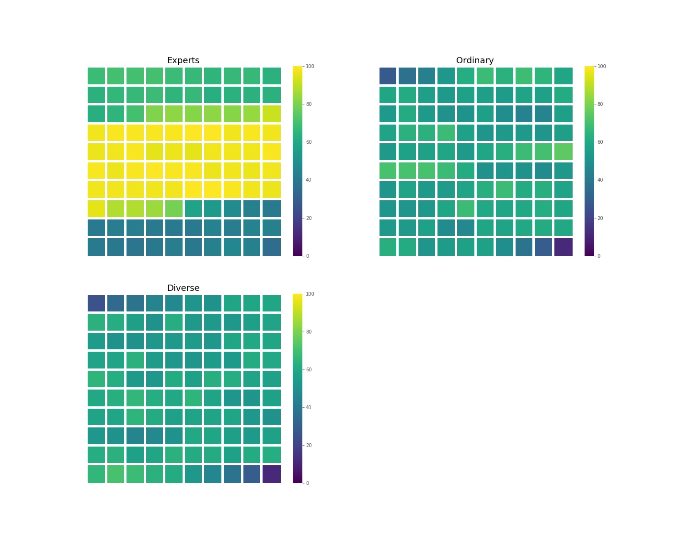
 * Different_Groups_ConfidenceAtVariousBlocks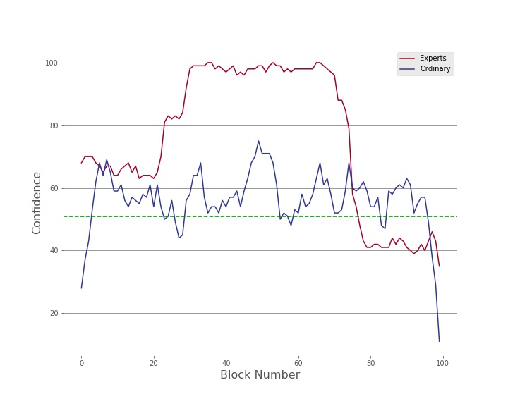
 * DiverseGroup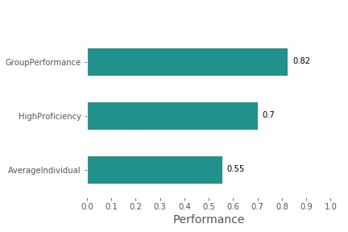* DiverseGroup1Demographics
 * DiverseGroup1_Group_Individual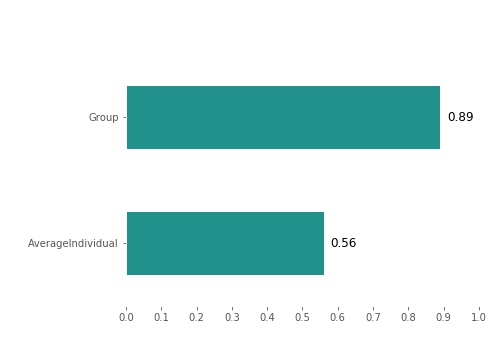
 * DiverseGroup1_Group_Specializations 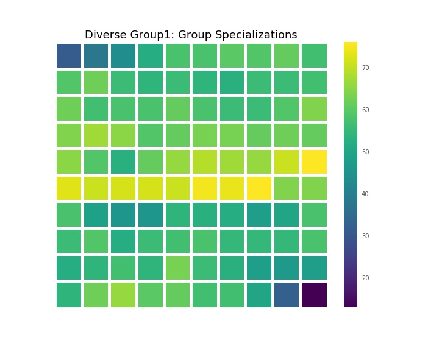
 * DiverseGroup2_Group_Specializations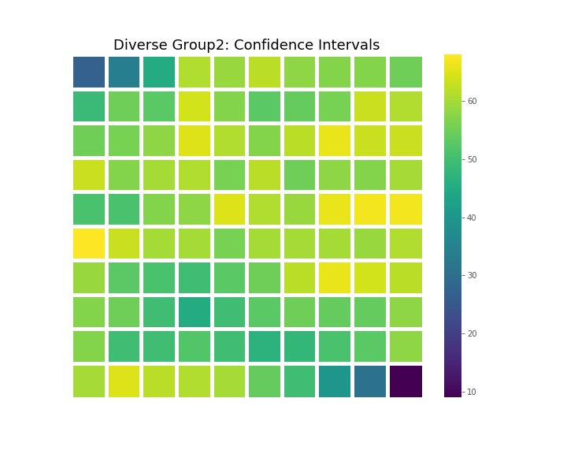
 * DiverseGroup2_Performance_Size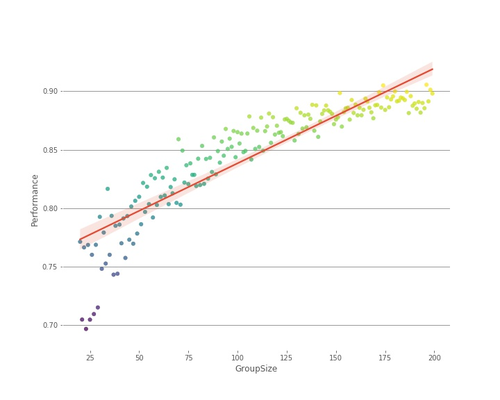
 * DiverseGroupIndividualSpecializations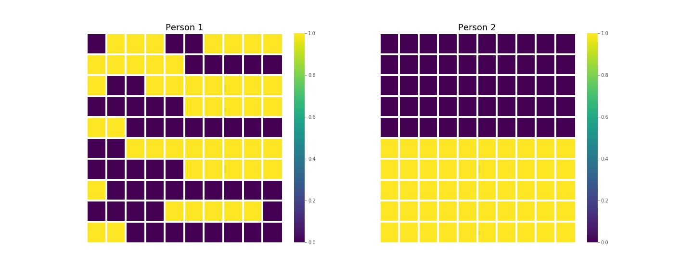
 * DiverseGroup_Performance_Groupsize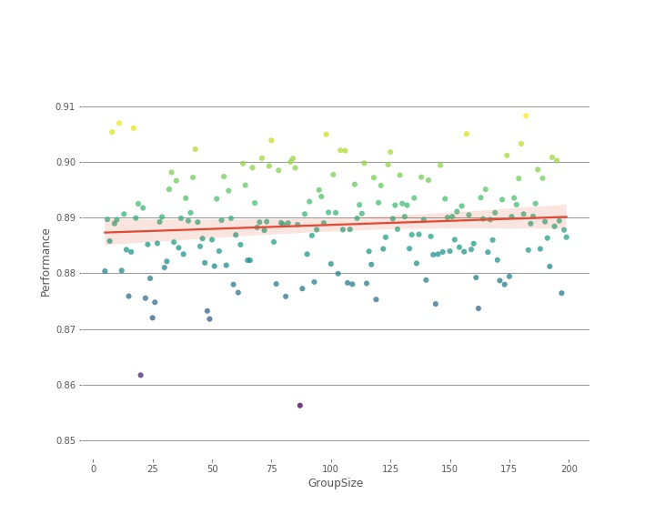
 * ExpertOnlyDemographics
 * ExpertPercentage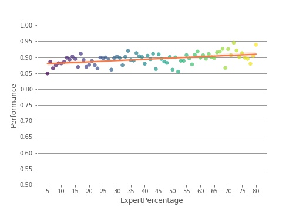
 * ExpertProficiency
 * ExpertsOnly_GroupSpecialization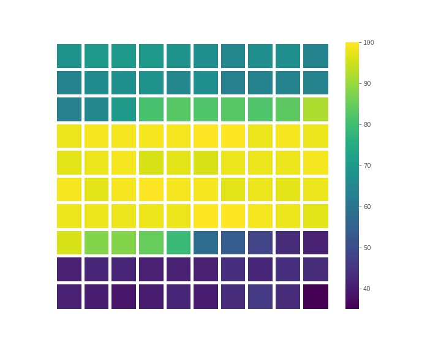
 * ExpertsOnly_Group_Individual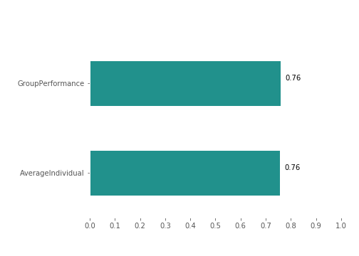
 * ExpertsOnly_IndividualSpecializations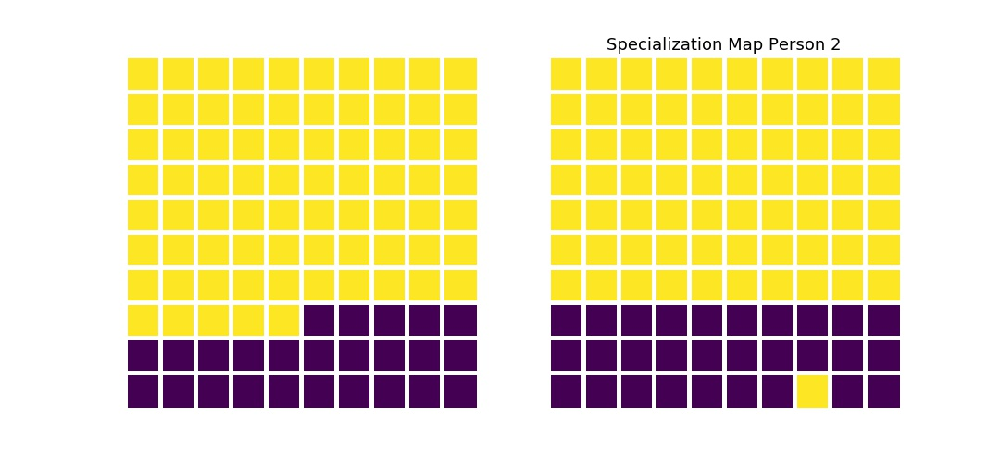* ExpertsOnly_Performance_Sizes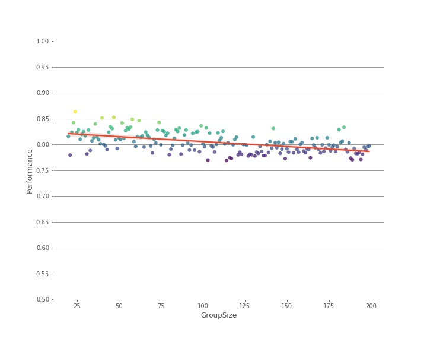
 * IndividualGroupPerformance
 * NewBackground* OrdinaryGroupDemographics
 * OrdinaryGroup_Different_sizes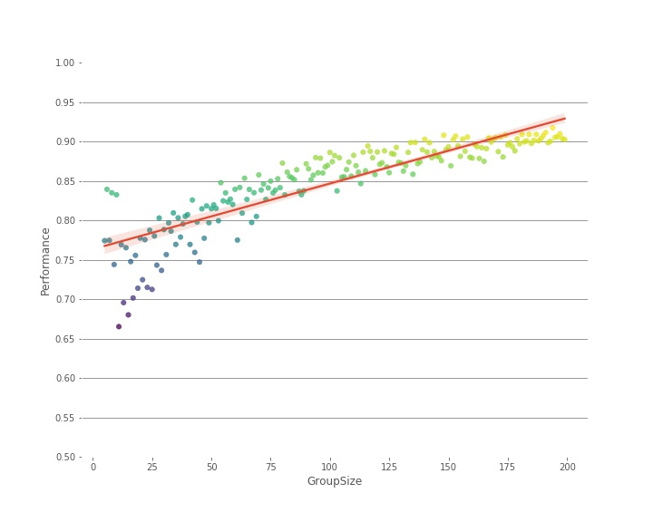
 * OrdinaryGroup_Group_Specializations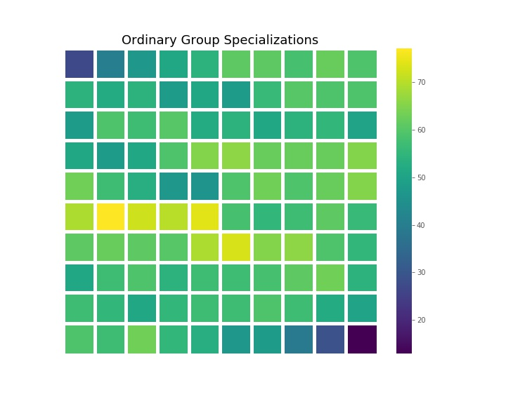
 * OrdinaryGroup_Individual_Group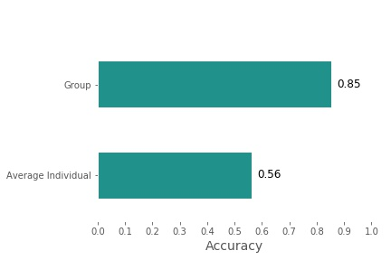* Simulation3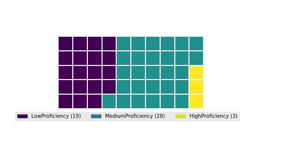
### Sources 
* Surowiecki, J. (2006). The wisdom of crowds: Why the many are smarter than the few and how collective wisdom shapes business, economies, societies, and nations. Abacus. 
* Bon, Gustavalle. (2021). Crowd. a study of the popular mind. HANSEBOOKS. 
