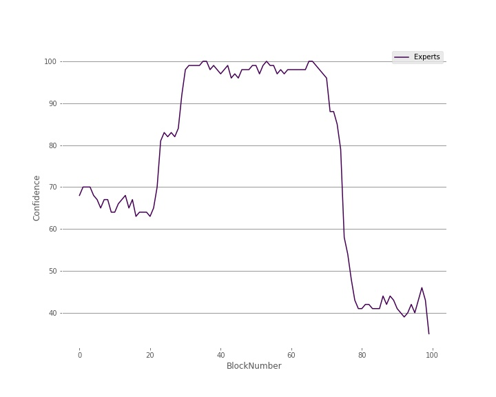
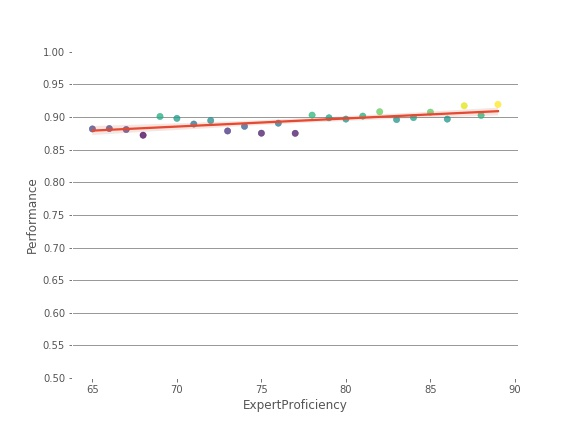

# wisdom-of-crowds-simulation
In India, 99.996% of drivers reach their destination safely without any incident. How is this fact relevant while considering if the masses are more reliable and intelligent than experts?

### Description
This project is an exploration into the question - "Is the crowd more intelligent than the most intelligent individual in the crowd?". A randomized computer simulation 
is created to answer this question and offer us insights on the same. A blog post sharing the findings of the project has been published - please check the next section for the same. 

### Blog
[Blog: Wisdom of Crowds: Insights from a Computer Simulation ](https://tippingathought.blogspot.com/2021/07/wisdom-of-crowds-insights-from-computer.html)

### Table of Contents

### PDF 
[Wisdom of Crowds Report PDF](./SimulationDraft-28-9-2020.pdf)

### Methodology 
* Build the computer simulation 
* Use the computer simulation to produce data 
* Analyze the data 
* Report the findings (visualizations)

### Modules 
* radnom 
* matplotlib
* seaborn
* sklearn
* pandas 
* numpy 
* os 

### Files 
* Computer Simulation Report (This includes the processing and analysis of the data)
* Wisdom of Crowds Development (This includes the development process of the computer simulation)
* SimulationDraft (Report with all the details)

### Story through images

 
 
 #### Individual Sepcializations
 * ExpertsOnly_Group_Individual
 * DiverseGroupIndividualSpecializations

 #### Group Specializations Heatmaps
 * OrdinaryGroup_Group_Specializations
 * ExpertsOnly_GroupSpecialization
 * DiverseGroup2_Group_Specializations
 * DifferentGroups_GroupSpecializations
  
 
 #### Confidence At Each Block
 * ConfidenceAtBlocks
 * Different_Groups_ConfidenceAtVariousBlocks
 

#### Analysis
 * Expert vs Oridnary at each block
 * DiverseGroup2_Performance_Size
 * DiverseGroup_Performance_Groupsize
 * ExpertPercentage
 * ExpertProficiency
 * OrdinaryGroupDemographics
 * OrdinaryGroup_Different_sizes

#### Comparison
 * Simulation3
 * IndividualGroupPerformance

#### Other Demographics

 * DiverseGroup* DiverseGroup1Demographics
 * DiverseGroup1_Group_Individual
 * DiverseGroup1_Group_Specializations 
 * ExpertOnlyDemographics

 * ExpertsOnly_IndividualSpecializations

 * OrdinaryGroup_Individual_Group

 
### Sources 
* Surowiecki, J. (2006). The wisdom of crowds: Why the many are smarter than the few and how collective wisdom shapes business, economies, societies, and nations. Abacus. 
* Bon, Gustavalle. (2021). Crowd. a study of the popular mind. HANSEBOOKS. 
